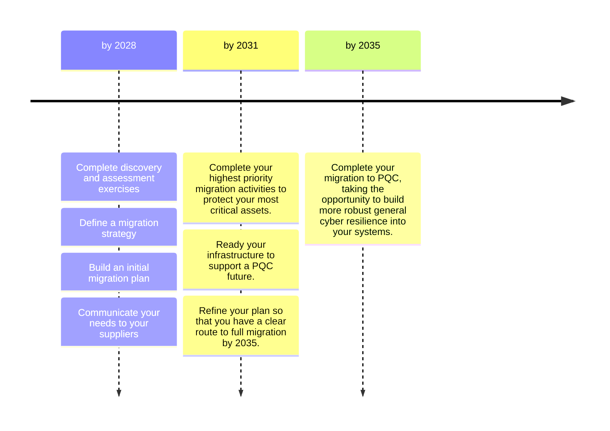

## Timeline

```mermaid
timeline
    by 2028 : Complete discovery and assessment exercises
            : Define a migration strategy
            : Build an initial migration plan
            : Communicate your needs to your suppliers
    by 2031 : Complete your highest priority migration activities to protect your most critical assets.
            : Ready your infrastructure to support a PQC future.
            : Refine your plan so that you have a clear route to full migration by 2035.
    by 2035 : Complete your migration to PQC, taking the opportunity to build more robust general cyber resilience into your systems.
```

## Sources

UK National Cyber Security Centre [Timelines for migration to post-quantum cryptography](https://www.ncsc.gov.uk/guidance/pqc-migration-timelines)