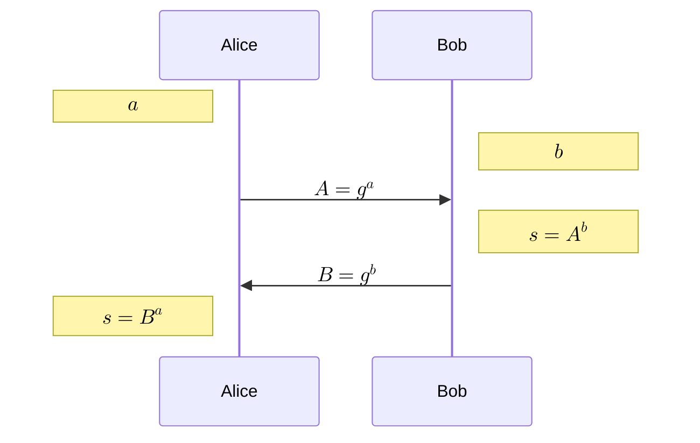

## Diffie-Hellman key exchange[^DifHel76]

- Public parameters:
    - $\mathbb{G}$ a cyclic group of order $n$ with efficient exponentiation and hard DLog
    - $g$ a generator of $\mathbb{G}$
- Independently:
    - Alice draws random secret $a\in \mathbb{Z}$
    - Bob draws random secret $b\in \mathbb{Z}$
- Alice and Bob exchange $g^a \mod n$, $g^b \mod n$ over an insecure, public channel.
- Alice and Bob can each compute $s=g^{ab} \mod n$

## Discrete Logarithm

The security of DH is based on the hardness of the discrete logarithm problem (DLP) on the group $\mathbb{G}$.

> [!important] Generalized DLP 
> Given a finite cyclic group $\mathbb{G}$ of order $n$, a generator $g$ of $\mathbb{G}$, and an element $y \in \mathbb{G}$, find the integer $x\in [0, n-1]$ such that $g^x=y$.

No efficient classical algorithm is known for computing discrete logarithms. The best currently known algorithm is the number field sieve (NFS). Some algorithms are not guaranteed to converge, or to find all solutions [^GraJou21].

{}

> [!note] Computational Diffie-Hellman (CDH) problem
> Given $g, g^x, g^y$, find $g^{xy}$.

> [!note] Decisional Diffie-Hellman (DDH) problem
> Given $g, g^x, g^y$, distinguish $g^{xy}$ from a random group element.

The CDH seems intuitive, but is hard to verify.

For a given group $\mathbb{G}$, if DLP is easy, then CDH is easy; if DDH is hard, then CDH is hard.
{}

## References

[^DifHel76]: Diffie, W., and Hellman, M. E. (1976). New directions in cryptography.
*IEEE Transactions on Information Theory*, *22*(6), 644–654.
https://doi.org/10.1109/TIT.1976.1055638

[^GraJou21]: Granger, R., and Joux, A. (2021). *Computing discrete logarithms*.
Cryptology ePrint Archive, Paper 2021/1140.
https://eprint.iacr.org/2021/1140