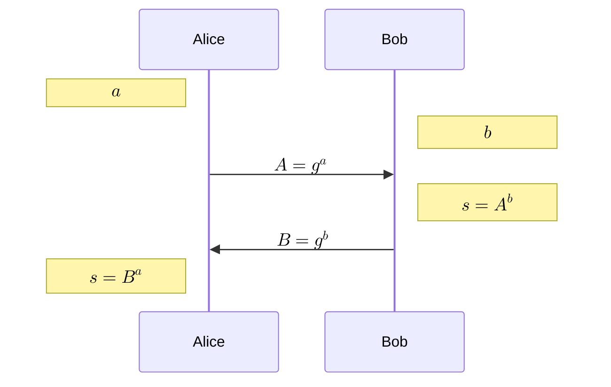

## Diffie-Hellman key exchange[^DifHel76] (DH KEX)

- Public parameters:
    - $\mathbb{G}$ a cyclic group of order $n$ with efficient exponentiation and hard DLog
    - $g$ a generator of $\mathbb{G}$
- Independently:
    - Alice draws random secret $a\in \mathbb{Z}$
    - Bob draws random secret $b\in \mathbb{Z}$
- Alice and Bob exchange $g^a \mod n$, $g^b \mod n$ over an insecure, public channel.
- Alice and Bob can each compute $s=g^{ab} \mod n$

## Discrete Logarithm problem

The security of DH is based on the hardness of the discrete logarithm problem (DLP) on the group $\mathbb{G}$.

> [!important] Generalized DLP 
> Given a finite cyclic group $\mathbb{G}$ of order $n$, a generator $g$ of $\mathbb{G}$, and an element $y \in \mathbb{G}$, find the integer $x\in [0, n-1]$ such that $g^x=y$.

No efficient classical algorithm is known for computing discrete logarithms. The best currently known algorithm is the number field sieve (NFS). Some algorithms are not guaranteed to converge, or to find all solutions [^GraJou21].

### Equivalence: computational and decisional DH

> [!note] Computational Diffie-Hellman (CDH) problem
> Given $g, g^x, g^y$, find $g^{xy}$.

> [!note] Decisional Diffie-Hellman (DDH) problem
> Given $g, g^x, g^y$, distinguish $g^{xy}$ from a random group element.

The CDH seems intuitive, but is hard to verify.

For a given group $\mathbb{G}$, if DLP is easy, then CDH is easy; if DDH is hard, then CDH is hard.

## DH Vulnerabilities

Vulnerabilities of Diffie-Hellman key exchange are well-studied[^ABD+15] [^Heninger21] in both theoretical and practical settings.

A DH KEX for Alice involves:
1. generating a secret $a$;
1. receiving a share $B=g^b$ from Bob;
1. computing a view of the shared secret $S=B^a$.

This means $S$ is a function of both Alice's own secret and external input, which Alice must sanitize but remains fundamentally a capability given to an attacker. One way to exploit this is a man-in-the-middle attack -- intercepting messages between Alice and Bob and, if there is no authentication on the channel, decrypting and re-encrypting all messages in between. However, this requires a constant active participation. Another is to confine Alice's view of the secret to a smaller subgroup in order to glean information on her secret $a$ from her encryption of following messages.

## References

[^ABD+15]: Adrian, D., Bhargavan, K., Durumeric, Z., Gaudry, P., Green, M.,
Halderman, J. A., Heninger, N., Springall, D., Thomé, E., Valenta, L.,
VanderSloot, B., Wustrow, E., Zanella-Béguelin, S., and Zimmermann, P.
(2015). Imperfect forward secrecy: How diffie-hellman fails in practice.
*Proceedings of the 22nd ACM SIGSAC Conference on Computer and
Communications Security*, 5–17. https://doi.org/10.1145/2810103.2813707

[^DifHel76]: Diffie, W., and Hellman, M. E. (1976). New directions in cryptography.
*IEEE Transactions on Information Theory*, *22*(6), 644–654.
https://doi.org/10.1109/TIT.1976.1055638

[^GraJou21]: Granger, R., and Joux, A. (2021). *Computing discrete logarithms*.
Cryptology ePrint Archive, Paper 2021/1140.
https://eprint.iacr.org/2021/1140

[^Heninger21]: Heninger, N. (2021). RSA, DH, and DSA in the wild. In J. Bos and M. Stam
(Eds.), *Computational cryptography: Algorithmic aspects of cryptology*
(pp. 140–181). <https://eprint.iacr.org/2022/048>; Cambridge University
Press.