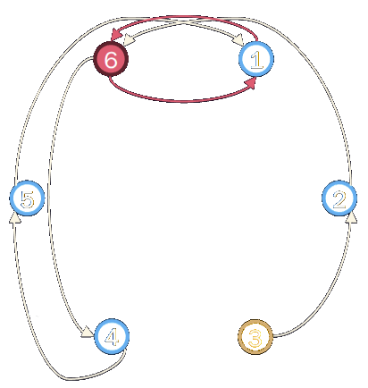

A quick primer to essential notions useful in cryptography. While this aims to be precise, it cannot and will not be exhaustive; please check out the wealth of resources available to students of cryptography[^BonSho23][^Heninger23][^Menezes24][^MenOorVan97].

## Modular arithmetic

Remainder after division of $a$ by $n$: $$a \pmod{n}=r$$

> [!note] Congruence
> $a$ is congruent to $b$ (modulo $n$) if and only if $n$ divides $a-b$:
> 
> $$
\begin{align*}
a &\equiv b \pmod{n} \iff n \mid a-b \\
a & -b = kn \quad \text{ for some }k
\end{align*}
$$

> [!note] Congruence / residue class
> The set of all integers
> $$ a+kn \quad \forall k$$
> is the *congruence / residue class* of $a$ modulo $n$, i.e., all integers with the same remainder as $a$ after division by $n$.

Integers 𝑚𝑜𝑑 𝑛 form an additive group ℤ𝑛■ Example: ℤ5

## Groups

> [!note] Group
> A set $\mathbb{G}$ with an operation $\circ$ such that it is:
> - closed under $\circ: \quad x_1 \circ x_2 \in \mathbb{G} \quad \forall x_1, x_2 \in \mathbb{G}$
> - $\exists$ an identity $i\in \mathbb{G}: \quad i \circ x = x \quad \forall x \in \mathbb{G}$
> - $\exists$ an inverse $x^{-1}\in \mathbb{G}: \quad x^{-1} \circ x = i \quad \forall x \in \mathbb{G}$
> - associative: $(x_1 \circ x_2) \circ x_3 = x_1 \circ (x_2 \circ x_3)$

> [!note] Cyclic group
> Every element of the group may be obtained by repeatedly applying the group operation $\circ$ to a generator element $g$.
> - $\exists$ at least one generator $g$ such that $\mathbb{G} = \left(\langle g \rangle,\circ\right)$

{}

In addition to the above, an Abelian group is
- commutative: $x_1 \circ x_2 = \circ x_2 \circ x_1 \quad \forall x_1, x_2 \in \mathbb{G}$

This is often implied unless otherwise stated as non-Abelian.

{}

### Order and subgroups

> [!note] Order
> The order of a group generated by $g$ is the smallest positive integer $o$ satisfying $g^o \equiv 1 \pmod{n}$. Equivalently, it is the number of distinct elements of the subgroup $\lbrace g^i\rbrace \pmod{n}$.

Subgroups may be generated by other elements.

> [!warning]
> $n-1$ is always a generator of $\lbrace n- 1,1\rbrace \pmod{n}$.

### Interesting groups

- The non-negative integers modulo $n$: $(\mathbb{Z}_n, +)$ is an additive cyclic group generated by $1$
- The positive integers modulo $n: x \in \lbrace 1,n-1\rbrace$ with multiplication ($\cdot$) is a multiplicative group $\mathbb{Z}_n^*$ if $n\in \lbrace 1,2,4,p^k, 2p^k\rbrace$ for $p$ an odd prime
- The points $(x,y)$ solutions to Elliptic Curve equations $E$ over finite fields $\mathbb{F}_p$ form an additive cyclic group
$$ E:\quad y^2 = x^3 + ax + b
$$
with $a,b \in \mathbb{F}_p$ and $4a^3 + 27b \neq 0$

### Finite field

> [!note] Finite field
> Loosely: a finite field $\mathbb{F}$ has finitely many elements with two operations, $+, \cdot$
> - All elements form an additive abelian group, with identity $0$
> - All non-zero elements form a multiplicative abelian group, with identity $1$
> - Multiplication distributes over addition: $a \cdot (b + c) = a\cdot b + a \cdot c$

## Example: $\mathbb{Z}_7^*$

3 and 5 are both generators of $\mathbb{Z}_7^*$. The order of elements induced by the powers of $g^i$ is hard to guess without computing all entries of a table, such as below. This also suggests that, given a random element $x \in \mathbb{G}$, it is hard to find an $i$ such that $g^i=x \pmod{n}$.

| $g^i$          | $x \in \mathbb{G}$             |
| ---           | ---             |
| $3^1$ | $3$ |
| $3^2$ | $9 \equiv 2 \pmod{7}$ |
| $3^3$ | $27 \equiv 6 \pmod{7}$ |
| $3^4$ | $81 \equiv 4 \pmod{7}$ |
| $3^5$ | $243 \equiv 5 \pmod{7}$ |
| $3^6$ | $729 \equiv 1 \pmod{7}$ |

As expected, $n-1=6$ is a generator of $\{6,1\} \pmod{7}$:

| $g^i$          | $x \in \mathbb{G}$             |
| ---           | ---             |
| $6^1$ | $6 \equiv -1 \pmod{7}$ |
| $6^2$ | $36 \equiv 1 \pmod{7}$ |
| $6^3$ | $216 \equiv -1 \pmod{7}$ |

## References

[^BonSho23]: Boneh, D., and Shoup, V. (2023). A graduate course in applied
cryptography. In *Draft 0.6*. <https://toc.cryptobook.us/>.

[^Heninger23]: Heninger, N. (2023). *Applied cryptography CSE 207B*.
<https://cseweb.ucsd.edu/classes/fa23/cse207B-a/>.

[^Menezes24]: Menezes, A. J. (2024). *Cryptography 101*.
<https://cryptography101.ca/>.

[^MenOorVan97]: Menezes, A. J., Oorschot, P. C. van, and Vanstone, S. A. (1997).
*Handbook of applied cryptography*. <https://cacr.uwaterloo.ca/hac/>.
https://doi.org/10.1201/9780429466335