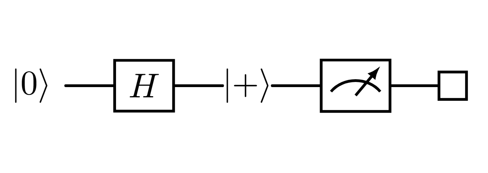

Assume we want to build a circuit using only one qubit. In this case, gates are unitary $2\times2$ matrices with complex coefficients. First, we present the simple and fundamental $\textbf{Pauli gates}$.

## Pauli gates
These gates are called $X, Y, Z$ as they perform rotations along the $x, y, z$ axes on a special sphere called [Bloch sphere](https://en.wikipedia.org/wiki/Bloch_sphere), which gives a visual representation of states for single qubits.

$$ X = \begin{bmatrix}
0 & 1\\
1 & 0 \\
\end{bmatrix} $$

$$ Y = \begin{bmatrix}
0 & -i\\
i & 0 \\
\end{bmatrix} $$

$$ Z = \begin{bmatrix}
1 & 0\\
0 & -1 \\
\end{bmatrix} $$

>[!REMARK]
>Let's see how X acts on the computational basis:
> $$X\ket{0}= \begin{bmatrix}
 0 & 1\\
 1 & 0 \\
 \end{bmatrix} \begin{pmatrix} 1 \\ 0 \end{pmatrix} = \begin{pmatrix} 0 \\ 1 \end{pmatrix} = \ket{1} $$
>and $$X\ket{1} = \ket{0}.$$ So, this gate is the quantum version of the NOT gate.

## Hadamard gate and Fourier basis

This gate will be very important in the following topics. It is defined as 
 $$H=\frac{1}{\sqrt{2}}\begin{bmatrix}
 1 & 1\\
 1 & -1 \\
 \end{bmatrix}.$$
From an algebraic perspective, it is a rotation of $45^\circ$ on the complex plane. Let's check its action on the computational basis.

$$H\ket{0}=\frac{1}{\sqrt{2}}\begin{bmatrix}
 1 & 1\\
 1 & -1 \\
 \end{bmatrix} \begin{pmatrix} 1 \\ 0 \end{pmatrix} = \frac{1}{\sqrt{2}}\begin{pmatrix} 1 \\ 1 \end{pmatrix}=  \frac{\ket{0} + \ket{1}}{\sqrt{2}}$$

 $$H\ket{1}=\frac{1}{\sqrt{2}}\begin{bmatrix}
 1 & 1\\
 1 & -1 \\
 \end{bmatrix} \begin{pmatrix} 0 \\ 1 \end{pmatrix} = \frac{1}{\sqrt{2}}\begin{pmatrix} 1 \\ -1 \end{pmatrix}=  \frac{\ket{0} - \ket{1}}{\sqrt{2}}$$

 We thus define these two particular states as:
 $$\ket{+} = \frac{\ket{0} + \ket{1}}{\sqrt{2}}$$
 $$\ket{-} = \frac{\ket{0} - \ket{1}}{\sqrt{2}}$$
 and we call \{$\ket{+}, \ket{-}$\} the $\textbf{Fourier basis}.$

{}

- It is an orthonormal basis;
- the change of basis matrix from the computational basis to the Fourier basis is the Hadamard gate (do you recall what we said about unitary transformations and o.n. bases?);
- it has a particular [representation on the Bloch sphere](https://quantum-education-modules.readthedocs.io/en/latest/introductory/qubits/bloch_sphere.html).
{}

{}
The Hadamard gate can be used to simulate a (simple) random bit generator. Starting from $\ket{0}$, we apply $\textbf{H}$ and then measure the resulting state. The result of the measurement will be $\ket{0}$ or $\ket{1}$ with the same probability $\frac{1}{2}$, correctly simulating a fair coin toss.

{}

>[!REMARK]
>The Hadamard gate transforms the states $\ket{0}$ and $\ket{1}$ in the superposition states $\ket{+}$ and $\ket{-}$, which are balanced (i.e. the probabilities are both $\frac{1}{2}$). Keep in mind this property as it will be useful to understand many of the topics, Shor's algorithm included.

Observe that $H$ is not only invertible, but it is its own inverse. A function such as this is called an involution and every transformation that is self-adjoint and unitary is an involution (prove as an exercise).

>[!EXERCISE]
>Show that $$Z\ket{+} = \ket{-}$$ and $$Z\ket{-} = \ket{+}.$$

## Circuit notation
An example of visual representation of a circuit is the following:

- The initial state is $\ket{0}$;
- the line is called "qubit register";
- the qubit passes through an Hadamard gate and its state becomes $\ket{+}$;
- the generic-meter-shaped symbol denotes the measurement: the system collapses to either $\ket{0}$ or $\ket{1}$.

We used $\square$ as a placeholder (it is not standard, it's just useful) of "$\ket{0}$ or $\ket{1}$, both with probability $\frac{1}{2}$."

$\textbf{NOTE}:$ every circuit ends with a measurement. In general, the output is not predictable, but one can design the circuit in order to obtain some desired result with high probability.

A question may arise: how can we assume to start with the state $\ket{0}$? It is a result of the so called "preparation", a physical process aimed to set the qubit in the determined state $\ket{0}$ (and so, also $\ket{1}$ by simply applying the $X$ gate). Of course, we can generalize this and say that the initial state may be assumed as every state which can be obtained starting from $\ket{0}$ and applying a given circuit.

