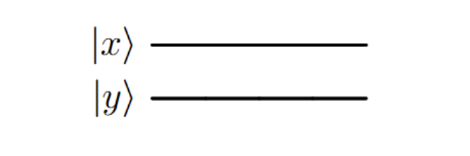

Assume we have 2 qubits for now. Generalizing from there is straightforward.

Intuitively, given 2 classical bits, the possible configurations are 4:
$$00$$
$$11$$
$$10$$
$$01$$
As in the single-qubit case, we make a notational trick and write the states:
$$\ket{0}\ket{0}$$
$$\ket{1}\ket{1}$$
$$\ket{1}\ket{0}$$
$$\ket{0}\ket{1}$$
Now, take a 2-qubits register:

Once measured, the possible configurations they may assume are the 4 we just saw. So, following the same idea of the single-qubit state, we can define the state $\ket{\Phi}$ of a 2-qubit register as 
$$ \ket{\Phi}= \alpha_1\ket{0}\ket{0}+\alpha_2\ket{0}\ket{1}+\alpha_3\ket{1}\ket{1}+\alpha_1\ket{1}\ket{1}$$

with the usual condition $$|\alpha_1|^2 + |\alpha_2|^2+ |\alpha_3|^2 +|\alpha_4|^2 = 1$$ and $\alpha_i\in \mathbb{C}$ for every $i=1,2,3,4$.

Why didn't we write $\ket{x}\ket{y}$ instead of $\ket{\Phi}$? This is the first taste of weirdness for this topic: not every 2-qubit system can be expressed as a "product", but we don't need to dive further in this here.

## Tensor product
We can express $\ket{0}\ket{0}$ as a vector as well. If a qubit can assume 2 possible configurations and thus its states can be represented by 2-dimensional complex vectors, it comes naturally that 2-qubit systems have states that can be represented by 4-dimensional complex vectors, as they have 4 possible configurations at the end of the day (i.e. after measurement). In general, $n$-qubit systems'state can be represented by $2^n$-dimensional complex vectors. We can use the same principle as before: we just perform a correspondence between states and vectors of the canonical basis of $\mathbb{C}^{2^n}$. So in our case:
$$\ket{0}\ket{0}\leftrightarrow \begin{pmatrix}1\\0\\0\\
0\end{pmatrix}$$ 
$$\ket{0}\ket{1}\leftrightarrow\begin{pmatrix}0\\1\\0\\
0\end{pmatrix}$$ 
$$\ket{1}\ket{0}\leftrightarrow\begin{pmatrix}0\\0\\1\\
0\end{pmatrix}$$ 
$$\ket{1}\ket{1}\leftrightarrow\begin{pmatrix}0\\0\\0\\
1\end{pmatrix}$$ 

No need to memorize which vector corresponds to which state, as we are about to introduce an operation that is behind the curtains of this correspondence: the tensor product.

Given two vectors $$\begin{pmatrix} a_1\\ \vdots \\ a_n \end{pmatrix}, \begin{pmatrix} b_1\\ \vdots \\ b_m \end{pmatrix},$$

we define their tensor product as:

$$\begin{pmatrix} a_1\\ \vdots \\ a_n \end{pmatrix} \otimes \begin{pmatrix} b_1\\ \vdots \\ b_m \end{pmatrix} = \begin{pmatrix}a_1b_1\\ \vdots \\ a_1b_m \\ a_2b_1\\ \vdots \\ a_2b_m \\ \vdots \\ a_nb_1 \\ \vdots \\ a_nb_m\end{pmatrix}.$$

The result is an $(n\times m)$-dimensional vector.

{}
>[!DEFINITION]
>Let $A \in \mathbb{K}^{m \times n}$ and $B \in \mathbb{K}^{p \times q}$ be two matrices over a field $\mathbb{K}$.  
The tensor product (also called the "Kronecker product") of $A$ and $B$ is the matrix $A \otimes B \in \mathbb{K}^{mp \times nq}$ defined as:
\[
A \otimes B =
\begin{bmatrix}
a_{11} B & a_{12} B & \cdots & a_{1n} B \\
a_{21} B & a_{22} B & \cdots & a_{2n} B \\
\vdots   & \vdots   & \ddots & \vdots   \\
a_{m1} B & a_{m2} B & \cdots & a_{mn} B
\end{bmatrix}
\]

Given $x, y, z \in \mathbb{C}^{2^n}$, $a,b \in \mathbb{C}$ and let $A, B, C, D$ be $2^n\times 2^n$ complex matrices. Then
- $(x + y) \otimes z = x \otimes z + y \otimes z$
- $z \otimes (x + y) = z \otimes x + z \otimes y$
- $a x \otimes b y = ab (x \otimes y)$
- $(A \otimes B)(C \otimes D) = (AC) \otimes (BD)$
- $(A \otimes B)(x \otimes y) = (Ax) \otimes (By)$
- $(A \otimes B)^{\dagger} = A^{\dagger} \otimes B^{\dagger}$

{}

Now we are ready to uncover the truth:

$$\ket{0}\ket{0} = \begin{pmatrix}1\\0\\0\\
0\end{pmatrix} = \begin{pmatrix}1\\0\end{pmatrix} \otimes \begin{pmatrix}1\\0\end{pmatrix}= \ket{0}\ket{0}= \ket{0} \otimes \ket{0}$$ 
and so on with the others. 

With no surprise, the intuition behind the use of this notation is actually supported by a rigorous algebraic system. One can think of the tensor product as a natural way to encode the possible configurations of a system composed of $n$ qubits.

