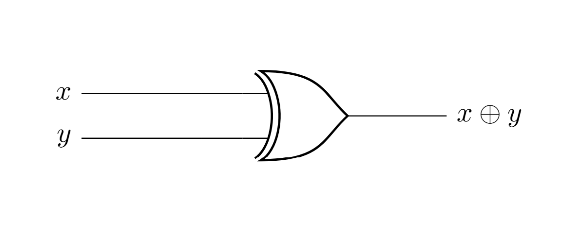
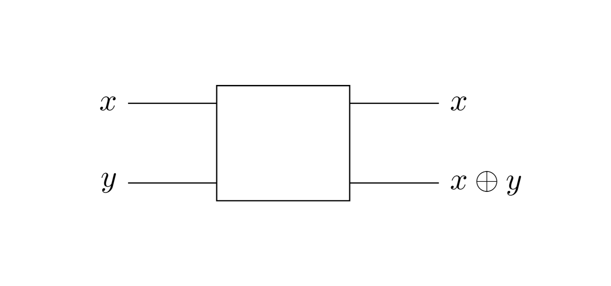
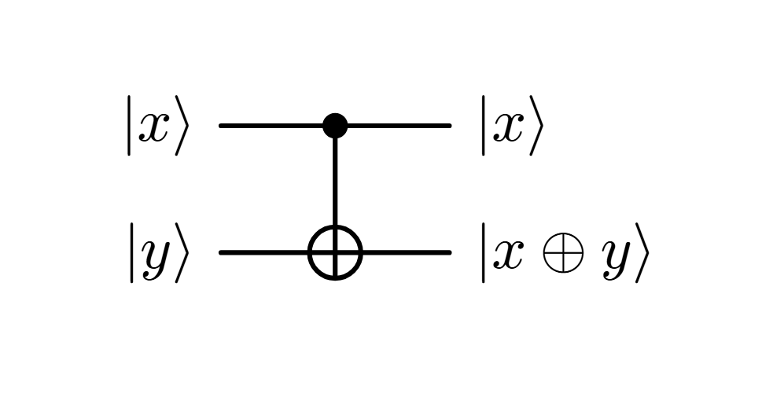

A classical 2-bit gate is the XOR gate:

The XOR gate is clearly not reversible. If we want to design its quantum counterpart, we need a reversible gate.

The most obvious way to make the XOR gate reversible is:

and it is a framework we will follow in the quantum setting.

## The controlled-NOT gate
The controlled-NOT gate ($\textbf{NOT}$) is defined as the following matrix:

$$\textbf{cNOT} = \begin{pmatrix}1&0&0&0\\ 
                        0&1&0&0\\
                        0&0&0&1\\
                        0&0&1&0\end{pmatrix}$$

Such that 
$$\textbf{cNOT}\ket{00} = \textbf{cNOT}\begin{pmatrix}1 \\0\\0\\0 \end{pmatrix} = \begin{pmatrix}1 \\0\\0\\0 \end{pmatrix} = \ket{00}  $$
 $$\textbf{cNOT}\ket{10} = \textbf{cNOT}\begin{pmatrix}0 \\0\\1\\0 \end{pmatrix} = \begin{pmatrix}0 \\0\\0\\1 \end{pmatrix} = \ket{11}$$
 and so on:
 $$\textbf{cNOT}\ket{11}=\ket{10}$$
  $$\textbf{cNOT}\ket{01}=\ket{01}$$

Its visual representation is the following: 

the $\ket{x}$ register is called $\textbf{control}$ qubit and the $\ket{y}$ register is called $\textbf{target}$: if the control's state is $\ket{0}$, then the gate applies a NOT operation on the target, otherwise it does nothing. The control qubit remains untouched by the gate, such as in the first example we made with the classical reversible XOR gate. As a matter of fact, this IS the reversible quantum-XOR gate we were looking for!

$\textbf{NOTE.}$ In Dirac notation: $$\textbf{cNOT}\ket{x}\ket{y}= \ket{x}\ket{x\oplus y}$$

