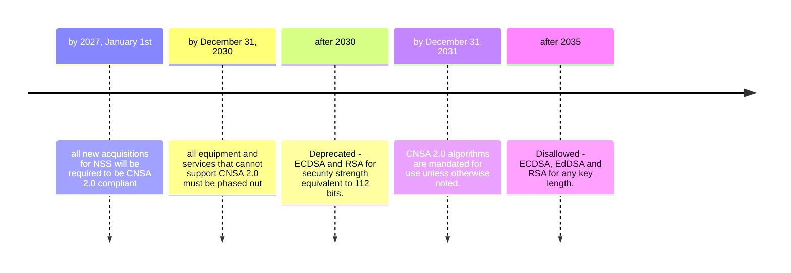

## Timeline

## Sources

NIST [Post-Quantum Cryptography Project](https://csrc.nist.gov/projects/post-quantum-cryptography)

NIST [IR 8547 Transition to Post-Quantum Cryptography Standards](https://csrc.nist.gov/pubs/ir/8547/ipd)

NCCoE [quantum readiness factsheet](https://www.nccoe.nist.gov/sites/default/files/2023-08/quantum-readiness-fact-sheet.pdf)

NSA [The Commercial National Security Algorithm Suite 2.0 and Quantum Computing FAQ](https://media.defense.gov/2022/Sep/07/2003071836/-1/-1/0/CSI_CNSA_2.0_FAQ_.PDF)