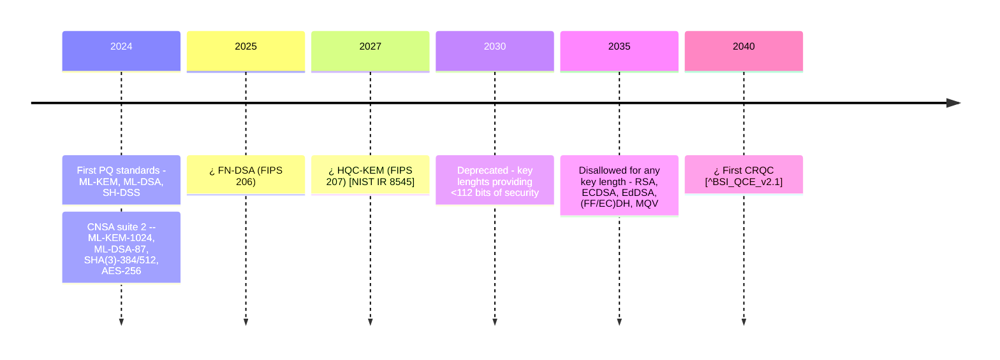

- The first Cryptographically Relevant Quantum Computer (CRQC) is expected around 2040, but may become availabe even before 2035:
> "even without large disruptions -- we estimate that the conservative end is now at 16 years [...] a plethora of new developments in error correction and mitigation as well as hardware [...] could accelerate the development to even below a decade."​[^BSI_QCE_v2.1]

- Classical asymmetric algorithms will be
  - Deprecated[^NIST_IR_8547] by 2030 for key lenghts providing <112 bits​ of security​[^NIST_SP_800-57]
    - RSA < 3072
    - FF (DSA,DH,MQV) < 3072​
    - EC (DSA,DH,MQV), EdDSA < 256-338​
  - Disallowed[^NIST_IR_8547] by 2035 for any key length -​ RSA, ECDSA, EdDSA, (FF/EC)DH, MQV​


    


## References

[^BSI_QCE_v2.1]: Bundesamt für Sicherheit in der Informationstechnik (BSI). (2025).
*Studie: Entwicklungsstand Quantencomputer Version 2.1*.
<https://www.bsi.bund.de/SharedDocs/Downloads/DE/BSI/Publikationen/Studien/Quantencomputer/Entwicklungstand_QC_V_2_1.html?nn=916616>.

[^NIST_IR_8547]: National Institute of Standards and Technology (NIST). (2024d).
Transition to post-quantum cryptography standards. In *Internal Report:
Vols. 8547 ipd*. <https://csrc.nist.gov/pubs/ir/8547/ipd>.

[^NIST_SP_800-57]: National Institute of Standards and Technology (NIST). (2020).
Recommendation for key management: Part 1 – general. In *Special
Publication: Vols. 800-57 rev.5*.
<https://csrc.nist.gov/pubs/sp/800/57/pt1/r5/final​>.