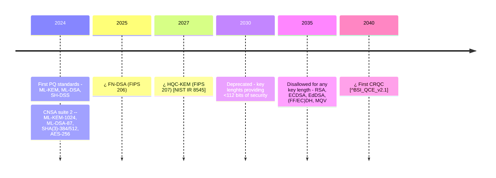

- The first Cryptographically Relevant Quantum Computer (CRQC) is expected[^BSI_QCE_v2.1] around 2040. However, "even without large disruptions -- we estimate that the conservative end is now at 16 years [...] a plethora of new developments in error correction and mitigation as well as hardware [...] could accelerate the development to even below a decade" [before 2035].​
- Classical asymmetric algorithms will be
  - Deprecated [^NIST_IR_8547] for key lenghts providing <112 bits​ of security​
    - RSA < 3072
    - FF (DSA,DH,MQV) < 3072​
    - EC (DSA,DH,MQV), EdDSA < 256-338​
  - Disallowed [^NIST_IR_8547] for any key length -​ RSA, ECDSA, EdDSA, (FF/EC)DH, MQV​

## NIST standardization winners

| Type          | Key Encapsulation Mechanism             | Digital Signature Algorithm            |
| ---           | ---             | ---                  |
| Lattice-based | ML-KEM[^FIPS_203] ([Kyber][Kyber]) | ML-DSA[^FIPS_204] ([Dilithium][Dilithium])   ¿ FN-DSA ([Falcon][Falcon])  |
| Code-based | [HQC][HQC]         |                      |
| Hash-based |                    | SLH-DSA[^FIPS_205] ([SPINCS][SPINCS]$^+$) |

[HQC]: https://pqc-hqc.org/
[SPINCS]: https://sphincs.org/
[Kyber]: https://en.wikipedia.org/wiki/Kyber
[Dilithium]: https://pq-crystals.org/dilithium/index.shtml
[Falcon]: https://falcon-sign.info/

## References

[^BSI_QCE_v2.1]: Bundesamt für Sicherheit in der Informationstechnik (BSI). (2025).
*Studie: Entwicklungsstand Quantencomputer Version 2.1*.
<https://www.bsi.bund.de/SharedDocs/Downloads/DE/BSI/Publikationen/Studien/Quantencomputer/Entwicklungstand_QC_V_2_1.html?nn=916616>.

[^FIPS_203]: National Institute of Standards and Technology (NIST). (2024a).
Module-lattice-based digital signature standard. In *FIPS* (Vol. 204).
<https://csrc.nist.gov/pubs/fips/204/final​>.

[^FIPS_204]: National Institute of Standards and Technology (NIST). (2024b).
Module-lattice-based key-encapsulation mechanism standard. In *FIPS*
(Vol. 203). <https://csrc.nist.gov/pubs/fips/203/final​>.

[^FIPS_205]: National Institute of Standards and Technology (NIST). (2024c).
Stateless hash-based digital signature standard. In *FIPS* (Vol. 205).
<https://csrc.nist.gov/pubs/fips/205/final​>.

[^NIST_IR_8547]: National Institute of Standards and Technology (NIST). (2024d).
Transition to post-quantum cryptography standards. In *Internal Report:
Vols. 8547 ipd*. <https://csrc.nist.gov/pubs/ir/8547/ipd>.